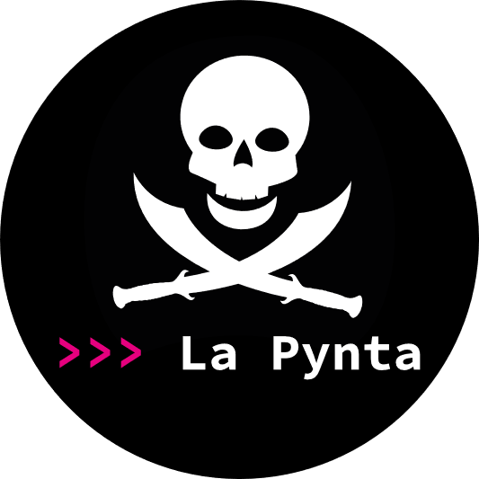

Devenez le plus grand pirate de Méditerranée !

## Jouer à la Pynta

Pour joueur à la-Pynta est un jeu qui se joue entièrement sur le terminal. Vous aurez néanmoins besoin d'une connection internet pour voir votre bateau bouger sur la carte. 
La carte est disponible sur le site [Carthapirate](https://carthapirates.fr/)

## Pour commencer

La Pynta est un jeu qui se joue entièrement sur le terminal. 

### Pré-requis

Plusieurs éléments sont nécessaires au fonctionnement du jeu

- Avoir une connection internet > Elle permet de voir votre bateau bouger sur la carte. 
       La carte est disponible sur le site [Carthapirate](https://carthapirates.fr/)
- Télécharger [Python](https://www.python.org/downloads/)

### Installation et Démarrage

Voici les différentes étapes de l'installation du programme :

- Sur Git, télécharger en zip _(Code -> Download ZIP)_
- Dézipper le fichier et lancer le fichier main.py

## Démarrage

Suivez les instructions qui s'affichent dans le terminal. Pour avoir une vision globale du jeu, consultez le diagramme d'activité en pdf.

## Fabriqué avec

Les logiciels et ressources suivantes ont été utilisés pour le développement du projet :

* [Python](https://www.python.org/) - Editeur de code
* [PyCharm](https://www.jetbrains.com/fr-fr/pycharm/) - IDE Python

## Versions

Version finale, datant du 7 janvier 2023

## Auteurs

* **Vincent Heau** [VincentHeau](https://gitlab.com/vincent.heau)
* **Océane Geffroy** [OceaneGeoffroy](https://gitlab.com/Oceane_)